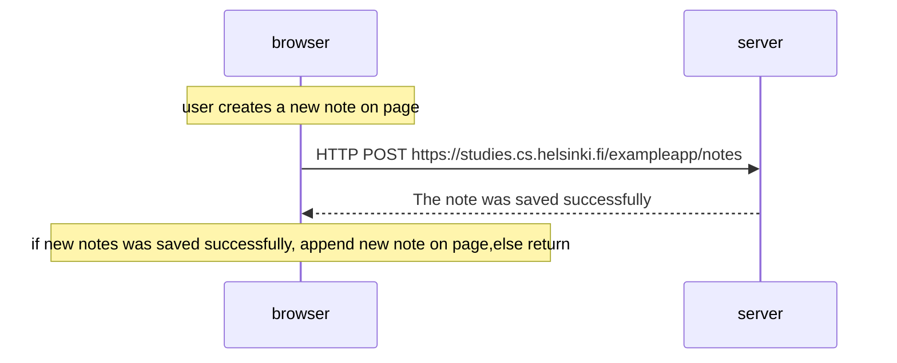
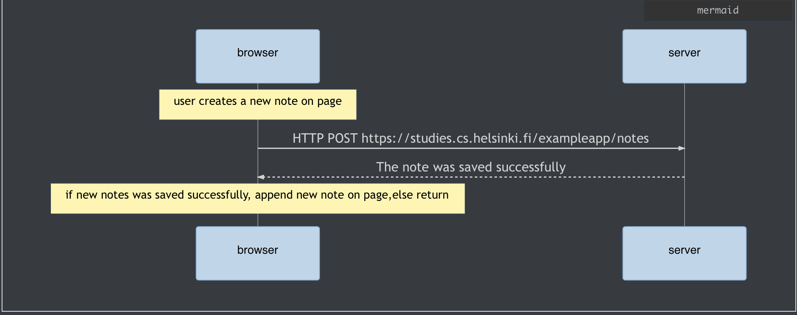

0.6: New note
--- 

```mermaid
sequenceDiagram
		note over browser: user creates a new note on page

		browser->>server:HTTP POST https://studies.cs.helsinki.fi/exampleapp/notes
		server-->>browser:The note was saved successfully
		note over browser:if new notes was saved successfully, append new note on page,else return
		
```
