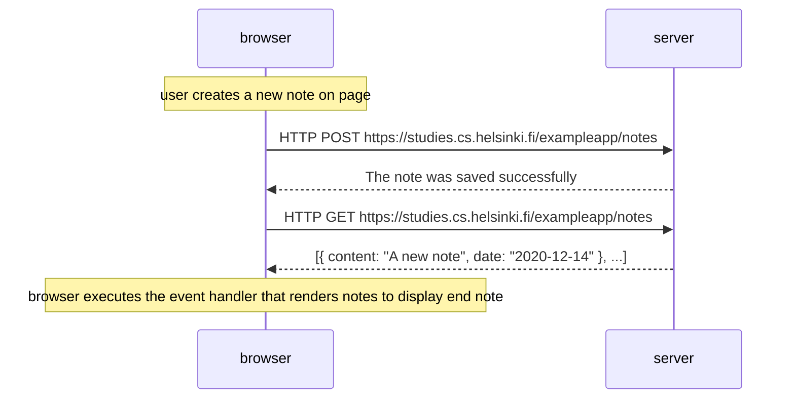
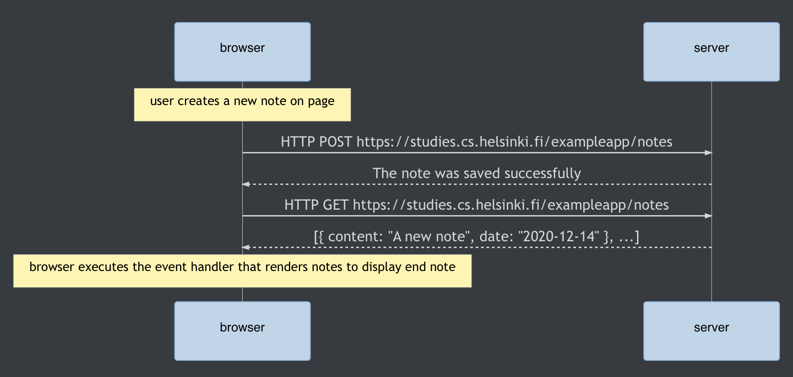

0.4: new note
---

```mermaid
sequenceDiagram
		note over browser: user creates a new note on page

		browser->>server:HTTP POST https://studies.cs.helsinki.fi/exampleapp/notes
		server-->>browser:The note was saved successfully
		browser->>server:HTTP GET https://studies.cs.helsinki.fi/exampleapp/notes
		server-->>browser:[{ content: "A new note", date: "2020-12-14" }, ...]
		note over browser: browser executes the event handler that renders notes to display end note
```

